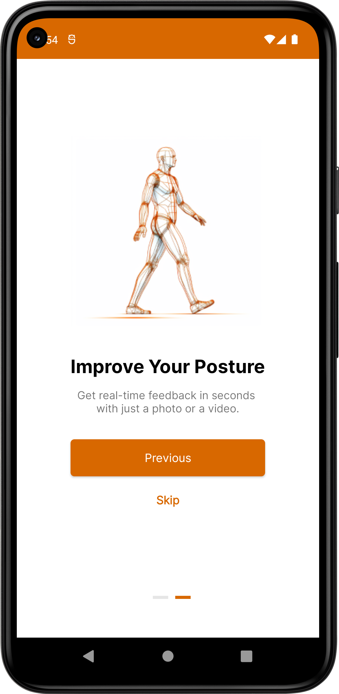
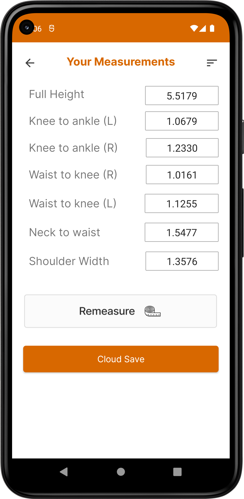
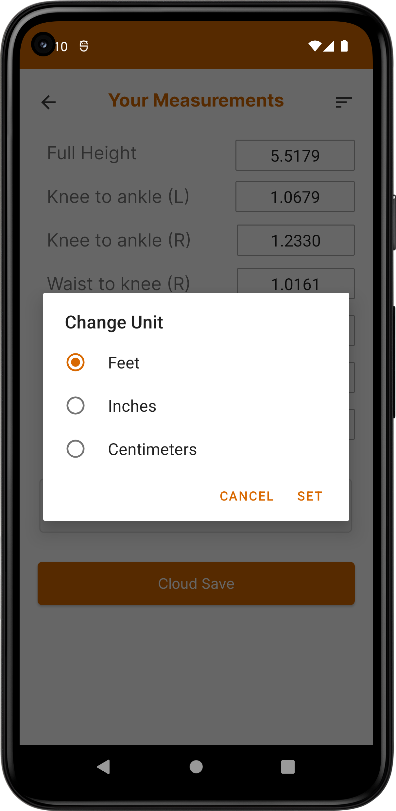

# FitFrame

Fit Frame is a software platform that utilizes sophisticated image processing algorithms to identify key attributes within a provided photograph, including the size and proportions of the human body. Through the examination of these attributes and approximate calculations, the platform can reasonably estimate the height of the individual depicted in the photograph

<h1> App Screenshots </h1> 

   
   
  
